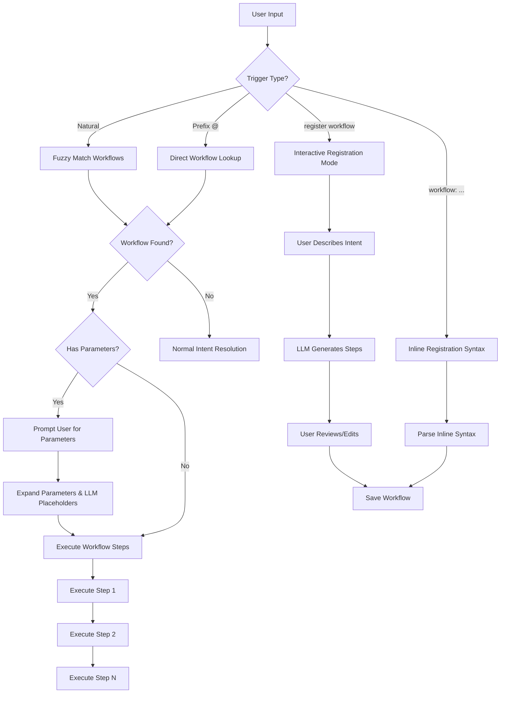

# Enhanced Multi-Step Workflow Registration System

## Architecture Overview



## Data Model Changes

### 1. Extend `src/learned.rs` - Multi-Step Workflow Support

**Current structure:**

```rust
struct CustomCommand {
    phrase: String,
    command: String,  // Single command
    timestamp: String,
    source: String,
}
```

**New structure:**

```rust
#[derive(Debug, Clone, Serialize, Deserialize)]
#[serde(untagged)]
enum WorkflowOrCommand {
    SimpleCommand(CustomCommand),
    Workflow(Workflow),
}

#[derive(Debug, Clone, Serialize, Deserialize)]
struct Workflow {
    name: String,
    description: Option<String>,
    parameters: Vec<Parameter>,
    steps: Vec<WorkflowStep>,
    timestamp: String,
    source: String,
}

#[derive(Debug, Clone, Serialize, Deserialize)]
struct Parameter {
    name: String,  // e.g., "branch", "message"
    prompt: String,  // e.g., "Enter branch name:"
    default: Option<String>,
}

#[derive(Debug, Clone, Serialize, Deserialize)]
struct WorkflowStep {
    name: String,  // e.g., "Build", "Test", "Deploy"
    command: String,  // Can contain {param} and {{LLM_PLACEHOLDER}}
    continue_on_error: bool,
}
```

**Methods to add:**

- `save_workflow()` - Save workflow to workflows.toml
- `match_workflow()` - Match user input to workflow, extract parameter needs
- `expand_workflow_step()` - Expand parameters and LLM placeholders in a step

### 2. New File: `src/workflows.rs` - Workflow Management

Create dedicated workflow management module:

```rust
pub struct WorkflowManager {
    workflows: HashMap<String, Workflow>,
}

impl WorkflowManager {
    pub fn load(path: &Path) -> Result<Self>;
    pub fn save(&self, path: &Path) -> Result<()>;
    pub fn match_workflow(&self, input: &str) -> Option<(Workflow, Vec<String>)>;
    pub async fn execute_workflow(&self, workflow: &Workflow, params: HashMap<String, String>, dispatcher: &mut impl IntentDispatcher) -> Result<()>;
}
```

## Interactive Registration Mode

### 3. Add `register_workflow` Tool to `src/tools.rs`

```rust
Tool {
    name: "register_workflow",
    description: "Register a new multi-step workflow with a name",
    examples: &["register workflow", "create workflow", "new workflow", "save workflow"],
    requires_repo: false,
}
```

### 4. Add Handler in `src/handlers.rs`

```rust
fn handle_register_workflow_intent<D: IntentDispatcher>(dispatcher: &mut D) {
    dispatcher.reply(
        "Let's create a new workflow!\n\n\
         What would you like to call it? (e.g., 'deploy to staging', 'full ci pipeline')"
    );
    dispatcher.set_pending_workflow(WorkflowState {
        kind: WorkflowKind::WorkflowRegistrationName,
        repo_root: dispatcher.get_session_repo_root().unwrap_or_else(|| dispatcher.get_session_cwd()),
    });
}
```

### 5. Workflow Registration State Machine in `src/workflow.rs`

Add new workflow kinds:

```rust
pub enum WorkflowKind {
    // ... existing kinds ...
    WorkflowRegistrationName,
    WorkflowRegistrationDescribe { name: String },
    WorkflowRegistrationReview { name: String, steps: Vec<WorkflowStep> },
    WorkflowRegistrationParams { name: String, steps: Vec<WorkflowStep> },
    WorkflowExecution { workflow: Workflow, current_step: usize, params: HashMap<String, String> },
}
```

**Registration flow:**

1. User: "register workflow"
2. CLI: "What would you like to call it?"
3. User: "deploy to production"
4. CLI: "Describe what this workflow should do:"
5. User: "build the app, run tests, push docker image, deploy to k8s"
6. CLI: Generates steps using LLM, shows preview
7. CLI: "Does this look good? [y]es, [e]dit step X, [a]dd step, [r]emove step Y, [p]arameters"
8. User: "p"
9. CLI: "Add parameters? Format: {name:prompt:default} or 'done'"
10. User: "{env:Environment (staging/prod):staging}"
11. CLI: Saves workflow

## Improved Inline Syntax

### 6. Enhance `src/user_feedback.rs` - Parse New Syntax

**Current syntax:** `cmd: git add -A && git commit`

**New syntax options:**

**Simple (single command):**

```
workflow: deploy = docker build && docker push
```

**Multi-step:**

```
workflow: deploy
  build: cargo build --release
  test: cargo test
  package: docker build -t app:latest .
  push: docker push app:latest
```

**With parameters:**

```
workflow: deploy to {env}
  build: cargo build --release
  push: scp target/release/app {env}.example.com:/app/
  restart: ssh {env}.example.com 'systemctl restart app'
```

**With LLM placeholders:**

```
workflow: smart commit
  stage: git add -A
  commit: {{GEN_COMMIT_MSG}}
  notify: echo "{{GEN_SUMMARY}}" | notify-send
```

Add parser in `src/user_feedback.rs`:

```rust
pub enum FeedbackResponse {
    // ... existing ...
    WorkflowInline(WorkflowDefinition),
}

pub struct WorkflowDefinition {
    pub name: String,
    pub steps: Vec<(String, String)>,  // (step_name, command)
    pub parameters: Vec<String>,  // Extracted {param} names
}

fn parse_workflow_syntax(input: &str) -> Option<WorkflowDefinition>;
```

## LLM Placeholder System

### 7. Extend `src/custom_command_generator.rs` - Add More Placeholders

**Existing:** `{{GEN_COMMIT_MSG}}`

**Add new placeholders:**

- `{{GEN_SUMMARY}}` - Generate summary of recent changes
- `{{GEN_PR_TITLE}}` - Generate pull request title
- `{{GEN_RELEASE_NOTES}}` - Generate release notes from commits
- `{{GEN_TEST_SUMMARY}}` - Summarize test results
- `{{ASK_LLM:prompt}}` - Ask LLM a custom question
```rust
pub fn expand_llm_placeholders(
    command: &str,
    config: &Config,
    repo_root: &Path,
    context: &SessionContext,
) -> Result<String> {
    let mut expanded = command.to_string();
    
    // Existing {{GEN_COMMIT_MSG}}
    if expanded.contains("{{GEN_COMMIT_MSG}}") {
        expanded = expand_commit_msg(expanded, config, repo_root)?;
    }
    
    // New {{GEN_SUMMARY}}
    if expanded.contains("{{GEN_SUMMARY}}") {
        expanded = expand_summary(expanded, config, repo_root)?;
    }
    
    // Pattern: {{ASK_LLM:your question here}}
    expanded = expand_ask_llm(expanded, config)?;
    
    Ok(expanded)
}
```


## Workflow Triggering & Execution

### 8. Update `src/fuzzy.rs` - Parameter-Aware Matching

```rust
pub fn fuzzy_match_workflow(
    input: &str,
    workflows: &WorkflowManager,
) -> Option<(Workflow, Vec<(String, Option<String>)>)> {
    // Match "deploy to staging" against workflow "deploy to {env}"
    // Return workflow + extracted parameter values
}
```

### 9. Update `src/app.rs` - Workflow Execution Flow

**When workflow matched with parameters:**

1. Check if all parameters have values (from input or defaults)
2. If missing parameters, prompt user
3. Expand all {params} and {{LLM_PLACEHOLDERS}}
4. Execute steps sequentially
5. Show progress for each step
```rust
fn execute_workflow_with_params(app: &mut App, workflow: Workflow, param_values: HashMap<String, String>) {
    let total_steps = workflow.steps.len();
    
    for (idx, step) in workflow.steps.iter().enumerate() {
        app.reply(format!("[{}/{}] {}: {}", idx + 1, total_steps, step.name, step.command));
        
        // Expand parameters
        let mut expanded = step.command.clone();
        for (param_name, param_value) in &param_values {
            expanded = expanded.replace(&format!("{{{}}}", param_name), param_value);
        }
        
        // Expand LLM placeholders
        expanded = expand_llm_placeholders(&expanded, &app.config, &repo_root, &app.session)?;
        
        // Execute
        match run_shell_command(&app.session.cwd, &expanded) {
            Ok(output) => app.reply(output),
            Err(e) if !step.continue_on_error => {
                app.reply(format!("Step failed: {}", e));
                return;
            }
            Err(e) => app.reply(format!("Step failed (continuing): {}", e)),
        }
    }
}
```


## Storage Format

### 10. New File: `.llm-cli/workflows.toml`

```toml
[[workflows]]
name = "deploy to {env}"
description = "Deploy application to specified environment"
timestamp = "1234567890"
source = "user_interactive"

[[workflows.parameters]]
name = "env"
prompt = "Target environment (staging/prod):"
default = "staging"

[[workflows.steps]]
name = "Build"
command = "cargo build --release"
continue_on_error = false

[[workflows.steps]]
name = "Deploy"
command = "scp target/release/app {env}.example.com:/app/"
continue_on_error = false

[[workflows.steps]]
name = "Restart"
command = "ssh {env}.example.com 'systemctl restart app'"
continue_on_error = false

[[workflows]]
name = "smart commit and push"
description = "Stage, commit with AI message, and push"
timestamp = "1234567891"
source = "user_inline"

[[workflows.steps]]
name = "Stage all"
command = "git add -A"
continue_on_error = false

[[workflows.steps]]
name = "Commit"
command = "{{GEN_COMMIT_MSG}}"
continue_on_error = false

[[workflows.steps]]
name = "Push"
command = "git push"
continue_on_error = false
```

## User Experience Examples

### Example 1: Interactive Registration

```
User: register workflow
CLI: What would you like to call it?
User: deploy to production
CLI: Describe what this workflow should do:
User: build app, run tests, create docker image, push to registry, update k8s
CLI: Generated workflow (5 steps):
     1. Build: cargo build --release
     2. Test: cargo test --release
     3. Package: docker build -t myapp:latest .
     4. Push: docker push myapp:latest
     5. Deploy: kubectl set image deployment/myapp myapp=myapp:latest
     
     [y]es to save, [e]dit step X, [p]arameters, [c]ancel
User: p
CLI: Add parameter? Format: {name:prompt:default} or 'done'
User: {tag:Docker tag:latest}
CLI: Parameter added. Add another? or 'done'
User: done
CLI: Saved! Try: "deploy to production" or "@deploy"
```

### Example 2: Inline Registration

```
User: I want to save this workflow
CLI: (after not matching existing commands)
User: workflow: quick backup
      dump: pg_dump mydb > backup.sql
      compress: gzip backup.sql
      upload: aws s3 cp backup.sql.gz s3://backups/
CLI: Saved workflow "quick backup" (3 steps)
```

### Example 3: Using Workflow with Parameters

```
User: deploy to staging
CLI: Matched workflow "deploy to {env}"
     Using env=staging
     [1/3] Build: cargo build --release
     ... (output) ...
     [2/3] Deploy: scp target/release/app staging.example.com:/app/
     ... (output) ...
     [3/3] Restart: ssh staging.example.com 'systemctl restart app'
     ... (output) ...
     All steps completed!
```

### Example 4: Prefix Triggering

```
User: @deploy
CLI: Which workflow?
     1. deploy to {env} - Deploy application to specified environment
     2. deploy frontend - Build and deploy frontend only
User: 1
CLI: Target environment (staging/prod): [staging]
User: prod
CLI: Executing...
```

## Implementation Order

1. **Data model** - Extend CustomCommand to Workflow structure in [src/learned.rs](src/learned.rs)
2. **Storage** - Add workflows.toml loading/saving
3. **LLM placeholders** - Extend [src/custom_command_generator.rs](src/custom_command_generator.rs) with new placeholders
4. **Workflow module** - Create [src/workflows.rs](src/workflows.rs) with WorkflowManager
5. **Interactive mode** - Add register_workflow tool and handler in [src/handlers.rs](src/handlers.rs)
6. **Inline syntax** - Enhance parser in [src/user_feedback.rs](src/user_feedback.rs)
7. **Fuzzy matching** - Update [src/fuzzy.rs](src/fuzzy.rs) for parameter extraction
8. **Execution** - Add workflow execution logic in [src/app.rs](src/app.rs)
9. **State machine** - Add workflow states in [src/workflow.rs](src/workflow.rs)
10. **Testing** - Test all flows with various scenarios

## Key Benefits

1. **Easier registration** - Interactive mode guides users step-by-step
2. **Flexible syntax** - Both inline and interactive for different preferences
3. **Reusable workflows** - Parameters make workflows adaptable
4. **Smart automation** - LLM placeholders handle dynamic content
5. **Better organization** - Multi-step workflows are cleaner than long chains
6. **Natural triggering** - Fuzzy matching + optional explicit prefix
7. **Backward compatible** - Existing custom_commands.toml still works